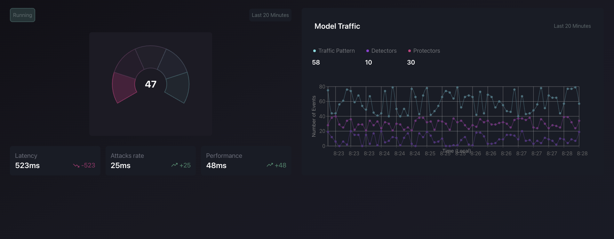

Deep dashboard

Description
This repository contains both the backend and frontend applications of our project.

**Backend:** Built with NestJS using Fastify as the HTTP server. It integrates with Redis and Kafka for messaging and data storage and enforce SSE communication with frontend. 
**Frontend:** Built with React and styled using Tailwind CSS.
Prerequisites
Before you begin, ensure you have the following installed on your machine:

Docker and Docker Compose
Node.js (version 18 or higher)

**Getting Started**
1. Clone the Repository
2. Install dependencies for web and backend by runnin `npm install` or `npm i`
3. Run `docker-compose up -d`
This will install kafka and redis locally on your machine. Kafka web-console should be available 
at [Web kafka](http://localhost:9021/clusters "Web kafka")
Redis on http://127.0.0.1:6379
4. After that you need to create .env files for both the backend and frontend applications to configure environment-specific settings.

**Samle .env for web:**

    VITE_PORT=3000
    
    VITE_MODEL_BASE_URL=http://127.0.0.1:4000

**Sample .env file for backend:**

    API_PORT=4000
    API_BASE_URL='0.0.0.0'
    API_VERSION=0.1.0
    
    APP_ENV=development
    
    #REDIS 
    REDIS_CLUSTER=127.0.0.1
    REDIS_CLUSTER_PORT=6379
    
    #KAFKA
    KAFKA_CLIENT_ID='model-client'
    KAFKA_GROUP_ID='model-consumer-server'
    KAFKA_BROKER='0.0.0.0:9092'
    KAFKA_CONSUMER='model-consumer-1,model-consumer-2'

Start your web by runing `npm run dev` and backend `npm run start:dev `
Frontend should be available at[ http://127.0.0.1:3000/dashboard]( http://127.0.0.1:3000/dashboard " http://127.0.0.1:3000/dashboard")

Backend on [ http://127.0.0.1:4000]( http://127.0.0.1:4000 " http://127.0.0.1:4000")

***NOTION*** : On the first backend run you might get a kafka error because topics are not populated yet, simply rerun it one more time

HealthCheck is available at  [http://127.0.0.1:4000/api/health](http://127.0.0.1:4000/api/health "http://127.0.0.1:4000/api/health")
